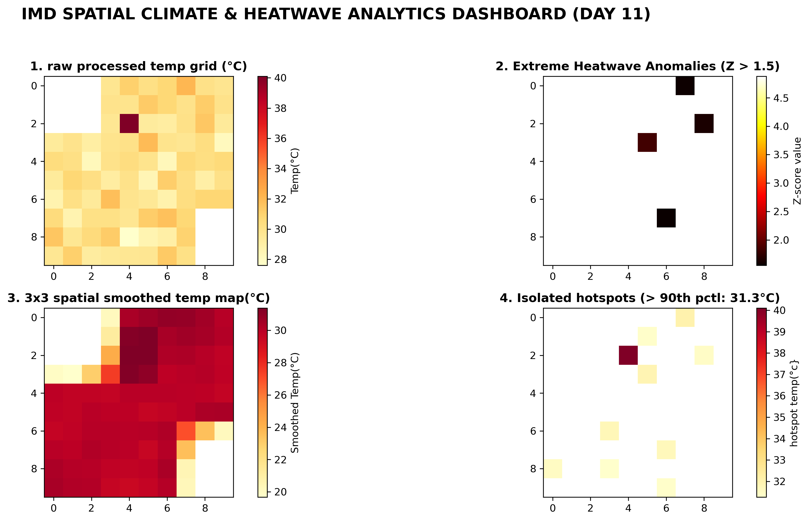

# 📡 IMD-Style Spatial Climate Analytics (Learning & Practice Project)

A hands-on Data Science learning project focused on understanding spatial-temporal climate analytics concepts using *simulated 3D grid data* ($10 \times 10$ spatial grid across 30 days). 

This project practices foundational techniques like land/sea masking, baseline climatology calculation, Z-score extreme anomaly detection, 2D spatial convolution smoothing, and percentile hotspot isolation.

> *Note:* This repository uses synthetically generated data to practice spatial data processing pipelines and visualization in Python. It does not use official live IMD NetCDF files.

---

## 📊 Executive Analytics Dashboard



---

## 🚀 Concept Implementation Breakdown

1. *Phase 1: Synthetic Spatial Ingestion & Land/Sea Masking*
   - Generated a synthetic 3D array (30 Days x 10 Lat x 10 Lon).
   - Applied a binary land/sea matrix mask using np.nan values to focus analysis solely on land regions.

2. *Phase 2: Baseline Climatology & Z-Score Anomaly Engine*
   - Calculated pixel-wise spatial mean ($\mu$) and standard deviation ($\sigma$) via np.nanmean and np.nanstd.
   - Identified thermal anomalies using Z-score calculation:
     $$Z = \frac{X - \mu}{\sigma}$$
   - Flagged extreme regional heat conditions where $Z > 1.5$.

3. *Phase 3: Spatial Smoothing & Edge Artifact Mitigation*
   - Applied np.pad(..., mode='symmetric') (Mirror Padding) to handle boundary values during convolution.
   - Used a $3 \times 3$ Spatial Convolution Kernel via scipy.signal.convolve2d to reduce simulated spatial noise.

4. *Phase 4: Percentile Hotspot Isolation*
   - Calculated the 90th percentile threshold across the dataset (np.nanpercentile).
   - Isolated and visualized critical temperature hotspots exceeding this threshold.

---

## 🛠️ Tech Stack & Libraries

- *Language:* Python 3.x
- *Core Libraries:* NumPy, SciPy (convolve2d)
- *Data Visualization:* Matplotlib
- *Environment:* Jupyter Notebook

---

## 💻 How to Run Locally

1. Clone the repository:
   ```bash
   git clone [https://github.com/isaacantony2805-afk/IMD-Spatial-Climate_Pipeline.git](https://github.com/isaacantony2805-afk/IMD-Spatial-Climate_Pipeline.git)
